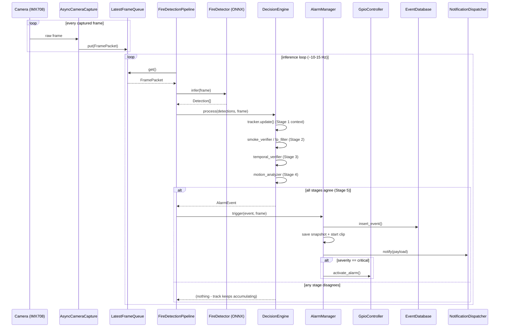
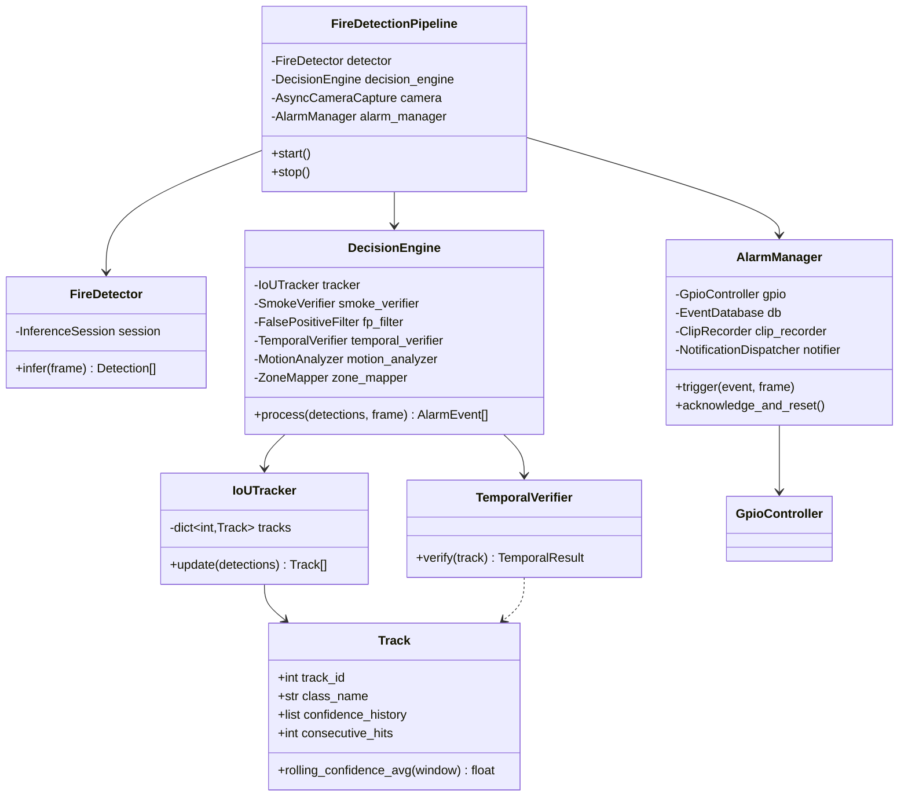

# System Architecture

## 1. Overview

The system is a single Python process (plus a thin FastAPI dashboard process)
running entirely on a Raspberry Pi 5's CPU. There is no cloud round-trip on
the detection-to-alarm path: the GPIO siren/relay fire locally, regardless of
network state. Cloud/MQTT/Firebase notifications are best-effort add-ons.

```
                          ┌─────────────────────────────────────────────────────┐
                          │                Raspberry Pi 5 (8GB)                  │
                          │                                                      │
 Camera Module 3  ───CSI──┼─▶ camera/capture.py (async thread, double buffer)    │
 NoIR Wide (IMX708)       │        │                                             │
                          │        ▼  LatestFrameQueue (bounded, drop-oldest)    │
                          │        │                                             │
                          │        ▼                                            │
                          │  inference/pipeline.py (inference-loop thread)       │
                          │        │                                             │
                          │        ▼                                            │
                          │  inference/preprocess.py (letterbox resize, NCHW)    │
                          │        │                                             │
                          │        ▼                                            │
                          │  inference/detector.py (ONNX Runtime, CPU EP)        │  Stage 1
                          │        │ Detection[]                                 │
                          │        ▼                                            │
                          │  inference/decision_engine.py                        │
                          │   ├─ tracker.py (IoU tracking)                       │
                          │   ├─ smoke_detector.py (dark channel + diffusion)    │  Stage 2
                          │   ├─ false_positive_filter.py (color/flicker/bbox)   │  Stage 2
                          │   ├─ temporal_verifier.py (8 frames, avg conf>85%)   │  Stage 3
                          │   ├─ motion_analyzer.py (frame-diff + optical flow)  │  Stage 4
                          │   └─ zone_mapper.py (stage/projector/podium/exit)    │
                          │        │ AlarmEvent[] (only on full agreement)       │  Stage 5
                          │        ▼                                            │
                          │  alarm/alarm_manager.py                              │
                          │   ├─ gpio/controller.py (buzzer, relay, LED)         │
                          │   ├─ alarm/recorder.py (snapshot + pre/post clip)    │
                          │   ├─ storage/db.py (SQLite event log)                │
                          │   └─ alarm/notifier.py (MQTT / Firebase / webhook)   │
                          │                                                      │
                          │  dashboard/app.py (FastAPI, same process space,      │
                          │   reads pipeline.latest_frame / latest_detections)   │
                          └─────────────────────────────────────────────────────┘
```

## 2. Why this shape

- **Two threads, one process, no multiprocessing.** ONNX Runtime's CPU EP
  releases the GIL during `session.run`, so a `ThreadPoolExecutor` gets real
  parallelism for inference without paying multiprocessing's duplicated
  memory cost (`8GB` total RAM means duplicating the ~6-15MB model + frame
  buffers across processes is wasteful, not free).
- **Bounded, latest-frame-wins queue between camera and inference.** A
  growing FIFO queue under CPU pressure would increase end-to-end alarm
  latency without bound. Dropping stale frames keeps latency bounded at the
  cost of occasionally skipping a frame - acceptable because the temporal
  verifier already requires many frames over multiple seconds.
- **The decision engine is intentionally a thick code path, not a second
  neural network.** Smoke verification, false-positive filtering, and motion
  analysis are all classical CV (OpenCV, NumPy) — see "Edge Computing
  Requirements" in the project brief: no second/third heavy model on a
  CPU-only Pi.
- **The GPIO alarm never depends on the dashboard or network.**
  `alarm_manager.trigger()` is called directly from the inference thread;
  MQTT/Firebase are fire-and-forget side effects that catch their own
  exceptions (see `alarm/notifier.py`) and can never block or skip the
  physical siren.

## 3. Module map

| Layer | Path | Responsibility |
|---|---|---|
| Camera | `camera/capture.py` | Picamera2 (Pi) / OpenCV (dev) async capture, double buffering |
| Preprocessing | `inference/preprocess.py` | Letterbox resize, NCHW float32 normalization |
| Detection | `inference/detector.py` | ONNX Runtime YOLO-family inference + NMS |
| Tracking | `inference/tracker.py` | Greedy IoU multi-object tracker, per-track history |
| Smoke verification | `inference/smoke_detector.py` | Dark-channel prior + diffusion heuristic |
| False-positive filter | `inference/false_positive_filter.py` | Color, flicker, bbox stability, static-light suppression |
| Temporal verification | `inference/temporal_verifier.py` | 8-consecutive-frame + rolling-average-confidence gate |
| Motion analysis | `inference/motion_analyzer.py` | Frame differencing + Farneback optical flow |
| Zone mapping | `inference/zone_mapper.py` | Maps detections to stage/projector/podium/exit zones |
| Decision engine | `inference/decision_engine.py` | Orchestrates stages 1-5, cooldown, severity |
| Pipeline orchestrator | `inference/pipeline.py` | Wires camera → detector → decision engine → alarm |
| GPIO | `gpio/controller.py` | Buzzer/relay/LED, mock backend off-Pi |
| Alarm | `alarm/alarm_manager.py`, `recorder.py`, `notifier.py` | Physical alarm, recording, notifications |
| Storage | `storage/db.py` | SQLite event log |
| Dashboard | `dashboard/app.py` + `dashboard/static/` | Live view, telemetry, history, acknowledge control |
| Training | `training/*.py` | Dataset prep, augmentation, train, export, benchmark |
| Config | `configs/*.yaml` + `utils/config.py` | All runtime tuning, no hardcoded constants |

## 4. Sequence diagram — single detection-to-alarm cycle



## 5. Class diagram (core inference/decision classes)



## 6. Data flow constraints (why the 5 stages, restated)

A single AlarmEvent requires **all** of:

1. **Stage 1** — the ONNX detector found a fire/smoke class above
   `confidence_threshold` (0.45) in this frame.
2. **Stage 2** — smoke-class detections pass the classical dark-channel/
   diffusion check; flame-class detections pass color-consistency AND
   flicker-frequency checks; all detections pass static-light-source
   suppression and bbox-stability checks.
3. **Stage 3** — the same tracked region has been seen for
   `consecutive_frames_required` (8) frames (gaps ≤ `max_gap_frames`
   tolerated) AND its rolling confidence average over the last
   `rolling_window_size` (16) frames is ≥ `min_average_confidence` (0.85).
4. **Stage 4** — the region shows real motion (frame-diff ratio above
   threshold) and that motion is not rigid/uniform translation (which would
   indicate a waving flag/banner rather than flame/smoke).
5. **Stage 5** — `require_all_stages: true` in `configs/decision.yaml`
   gates the final AlarmEvent; cooldown prevents duplicate alarms for the
   same class+zone within `cooldown_after_alarm_s` (120s).

This is what makes "alarm never fires from a single frame" a structural
property of the code, not a tuning parameter that could be defeated by a
single high-confidence false detection.
