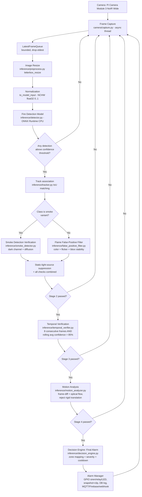
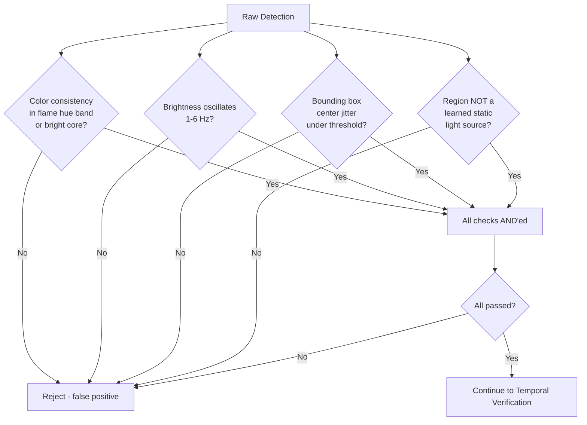
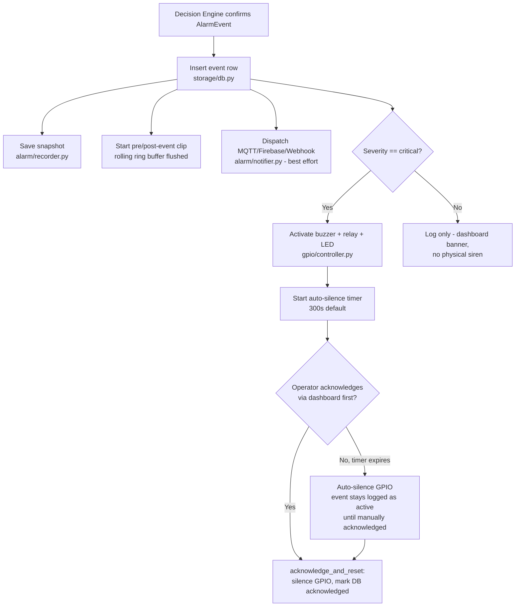

# Flowcharts

## 1. End-to-end inference pipeline

```mermaid
flowchart TD
    A[Camera: Pi Camera Module 3 NoIR Wide] --> B[Frame Capture\ncamera/capture.py - async thread]
    B --> C[LatestFrameQueue\nbounded, drop-oldest]
    C --> D[Image Resize\ninference/preprocess.py letterbox_resize]
    D --> E[Normalization\nto_model_input - NCHW float32 0..1]
    E --> F[Fire Detection Model\ninference/detector.py - ONNX Runtime CPU]
    F --> G{Any detection\nabove confidence\nthreshold?}
    G -- No --> B
    G -- Yes --> H[Track association\ninference/tracker.py IoU matching]
    H --> I{Class is smoke\nvariant?}
    I -- Yes --> J[Smoke Detection Verification\ninference/smoke_detector.py\ndark channel + diffusion]
    I -- No --> K[Flame False-Positive Filter\ninference/false_positive_filter.py\ncolor + flicker + bbox stability]
    J --> L
    K --> L[Static-light-source suppression\n+ all checks combined]
    L --> M{Stage 2 passed?}
    M -- No --> B
    M -- Yes --> N[Temporal Verification\ninference/temporal_verifier.py\n8 consecutive frames AND\nrolling avg confidence > 85%]
    N --> O{Stage 3 passed?}
    O -- No --> B
    O -- Yes --> P[Motion Analysis\ninference/motion_analyzer.py\nframe-diff + optical flow,\nreject rigid translation]
    P --> Q{Stage 4 passed?}
    Q -- No --> B
    Q -- Yes --> R[Decision Engine: Final Alarm\ninference/decision_engine.py\nzone mapping + severity + cooldown]
    R --> S[Alarm Manager\nGPIO siren/relay/LED,\nsnapshot+clip, DB log,\nMQTT/Firebase/webhook]
    S --> B
```

## 2. False-positive reduction decision detail

```mermaid
flowchart TD
    Det[Raw Detection] --> Color{Color consistency\nin flame hue band\nor bright core?}
    Det --> Flicker{Brightness oscillates\n1-6 Hz?}
    Det --> Stable{Bounding box\ncenter jitter\nunder threshold?}
    Det --> Static{Region NOT a\nlearned static\nlight source?}
    Color -- No --> Reject[Reject - false positive]
    Flicker -- No --> Reject
    Stable -- No --> Reject
    Static -- No --> Reject
    Color -- Yes --> Combine
    Flicker -- Yes --> Combine
    Stable -- Yes --> Combine
    Static -- Yes --> Combine[All checks AND'ed]
    Combine --> Pass{All passed?}
    Pass -- Yes --> Continue[Continue to Temporal Verification]
    Pass -- No --> Reject
```

## 3. Alarm lifecycle

```mermaid
flowchart TD
    Trigger[Decision Engine confirms AlarmEvent] --> Log[Insert event row\nstorage/db.py]
    Log --> Snap[Save snapshot\nalarm/recorder.py]
    Log --> Clip[Start pre/post-event clip\nrolling ring buffer flushed]
    Log --> Notify[Dispatch MQTT/Firebase/Webhook\nalarm/notifier.py - best effort]
    Log --> Sev{Severity == critical?}
    Sev -- Yes --> GPIO[Activate buzzer + relay + LED\ngpio/controller.py]
    Sev -- No --> NoSiren[Log only - dashboard banner,\nno physical siren]
    GPIO --> Timer[Start auto-silence timer\n300s default]
    Timer --> Wait{Operator acknowledges\nvia dashboard first?}
    Wait -- Yes --> Reset[acknowledge_and_reset:\nsilence GPIO, mark DB acknowledged]
    Wait -- No, timer expires --> AutoSilence[Auto-silence GPIO\nevent stays logged as active\nuntil manually acknowledged]
    AutoSilence --> Reset
```
